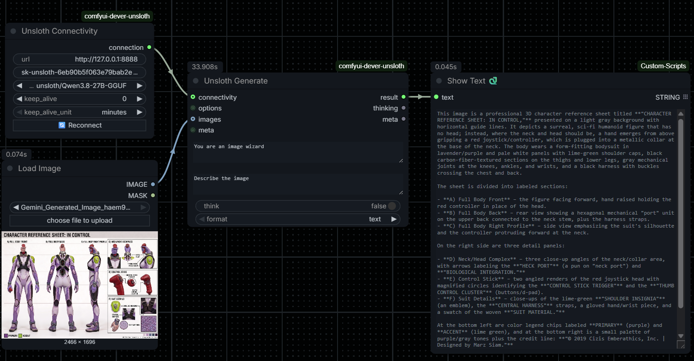

# comfyui-dever-unsloth

Ollama-style ComfyUI nodes for an **Unsloth Desktop** (llama.cpp) backend.
Same 3-node simplicity as `comfyui-ollama` — Connectivity, Options, Generate —
but talks to the OpenAI-compatible HTTP API Unsloth Desktop exposes
(default `http://127.0.0.1:8888`, Bearer API key).

## Nodes

| Node | Purpose |
|---|---|
| **Unsloth Connectivity** | Server URL, API key, model dropdown (🔄 Reconnect button), keep-alive. The dropdown lists models **downloaded locally** in Unsloth Desktop (incomplete downloads excluded) — not the full catalog of models it can use. |
| **Unsloth Options** | Enable-flagged sampling params (temperature, top_p, top_k, min_p, repetition_penalty, presence_penalty, seed, stop, max_tokens). Only enabled values are sent. |
| **Unsloth Generate** | system + prompt (+ optional IMAGE for vision, `think`, text/json format) → `result`, `thinking`, `meta` (for chaining). |

## Requirements

- Unsloth Desktop running with **Settings → "Model auto-switch (OpenAI API)" enabled**.
  This lets a chat request name any downloaded GGUF and Unsloth loads it
  in-request before responding. Without it, the node raises a clear error
  telling you to load the model in Unsloth Desktop or enable auto-switch.
- An API key from Unsloth Desktop **Settings → API** (the OpenAI API requires it).

## Keep-alive (Ollama-compatible semantics)

Unsloth's OpenAI API has no per-request `keep_alive`, so it is emulated
client-side using Unsloth's `POST /v1/unload`:

| `keep_alive` | Behavior |
|---|---|
| `0` | Unload the model immediately after the response. |
| `N` (>0) | A background heartbeat keeps the model warm; it unloads N (minutes/hours) after the last generation. |
| `-1` | Keep the model loaded indefinitely. |

Only one model is active per Unsloth server at a time; the heartbeat is keyed
per server URL and follows whichever model the workflow last generated with.

## Notes

- `num_ctx` (context size) is a **load-time** setting in Unsloth, not a
  per-request parameter, so it is intentionally not exposed here.
- No new dependencies — uses `requests`, already in the ComfyUI environment.
